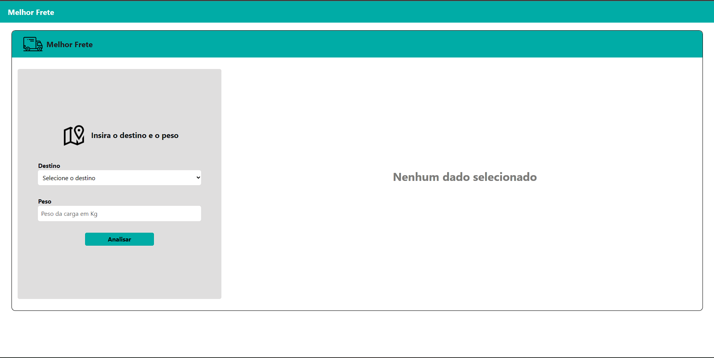
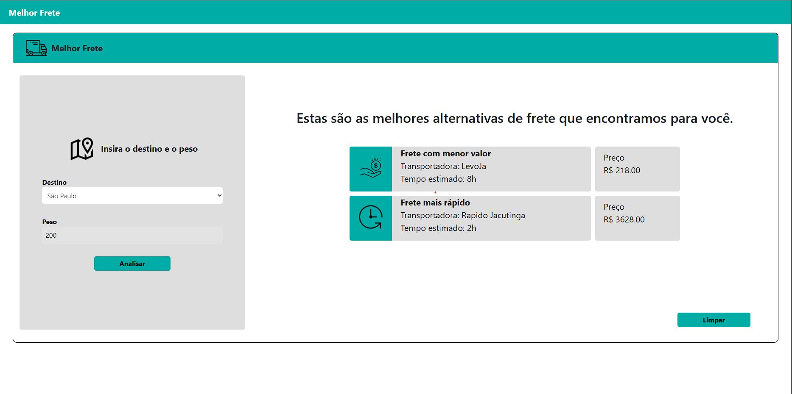
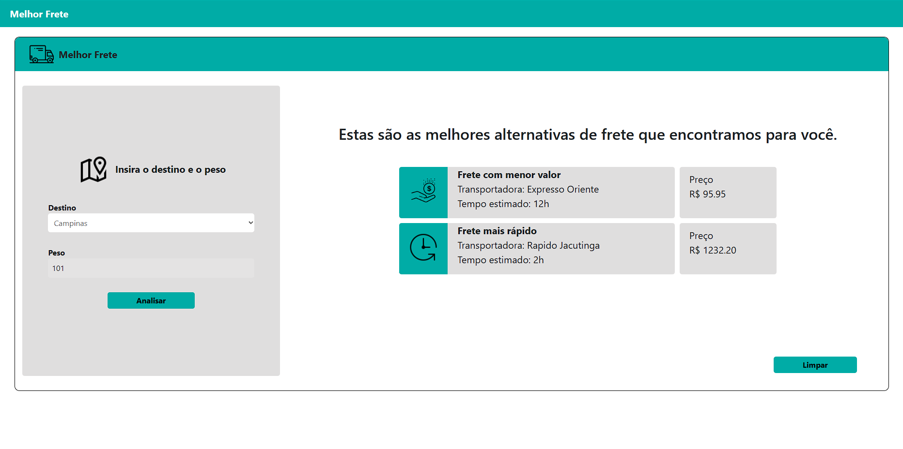

# Desafio-CoorLab

Para implementação do código do desafio foram usadas as seguintes tecnologias no Front-end:
* Vue : Framework principal de desenvolvimento;
* Axios : Utilizado para realizar as requisições a API;

Como o projeto já fornece uma API, não foi nescessário a criação de um Back-end.

A implementação no Front-end foi feita baseada em componentes, onde os dados da API são resgatados no componenete principal (BestTransport.vue) e são repassados ao componente de resposta (ResponseMsg.vue) que é responsável por renderizar os dados corretos. Todas as verificações e funcionalidades estão implementadas no componente principal, e importadas as nescessárias para o componente de resposta.

## Tela inicial 

## Tela com resposta

